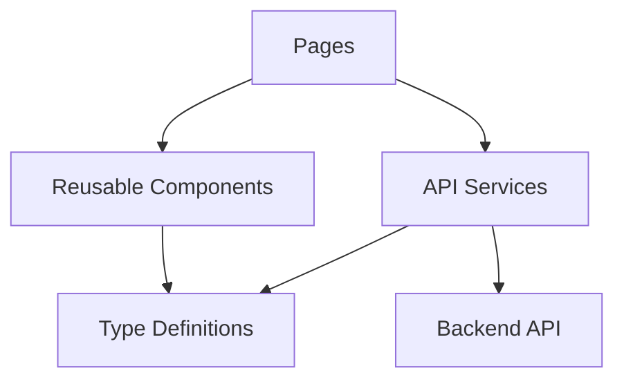
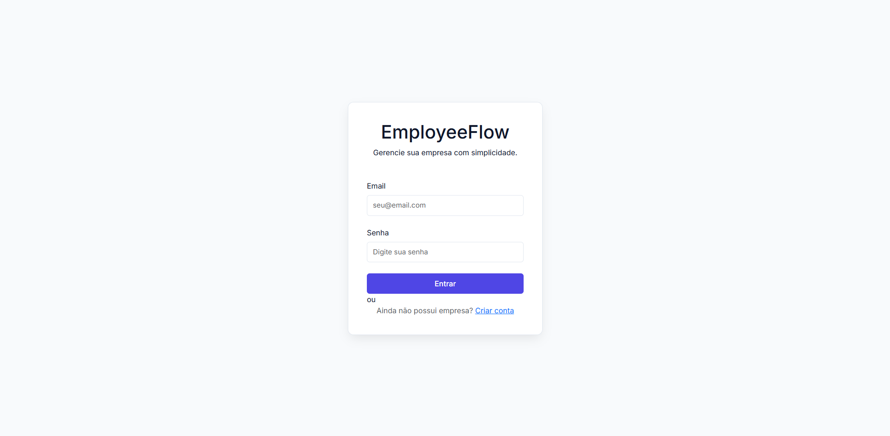
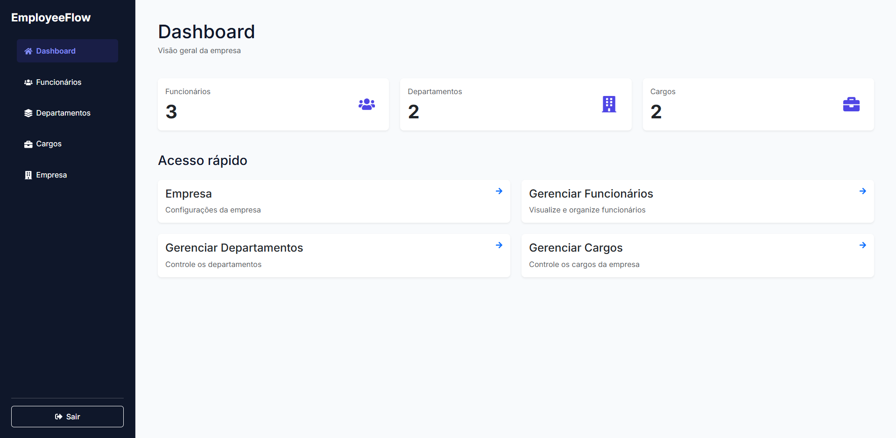
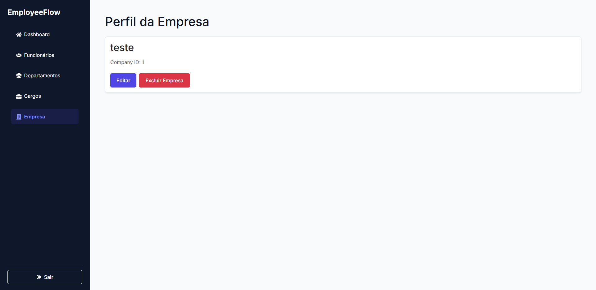
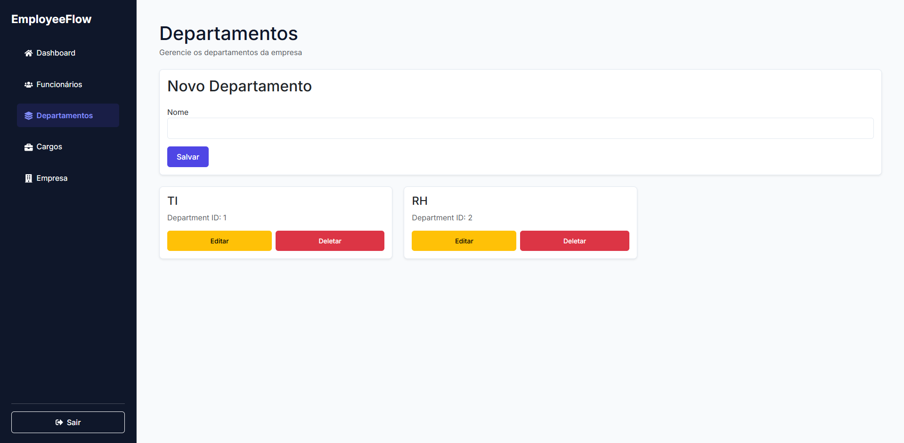
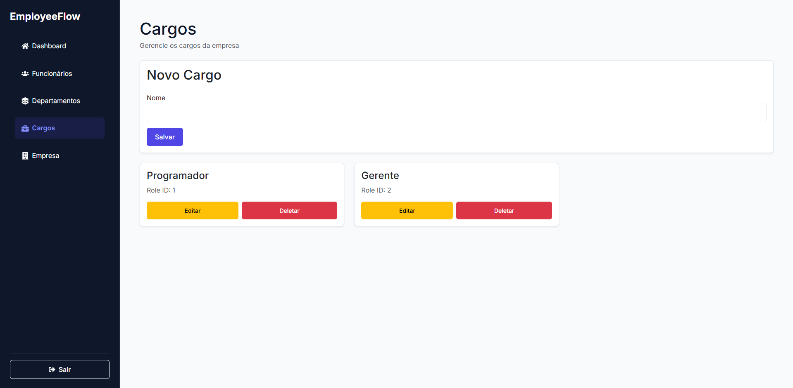
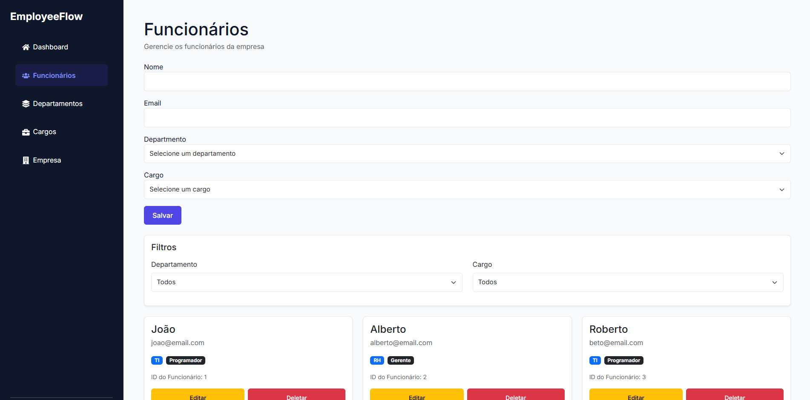
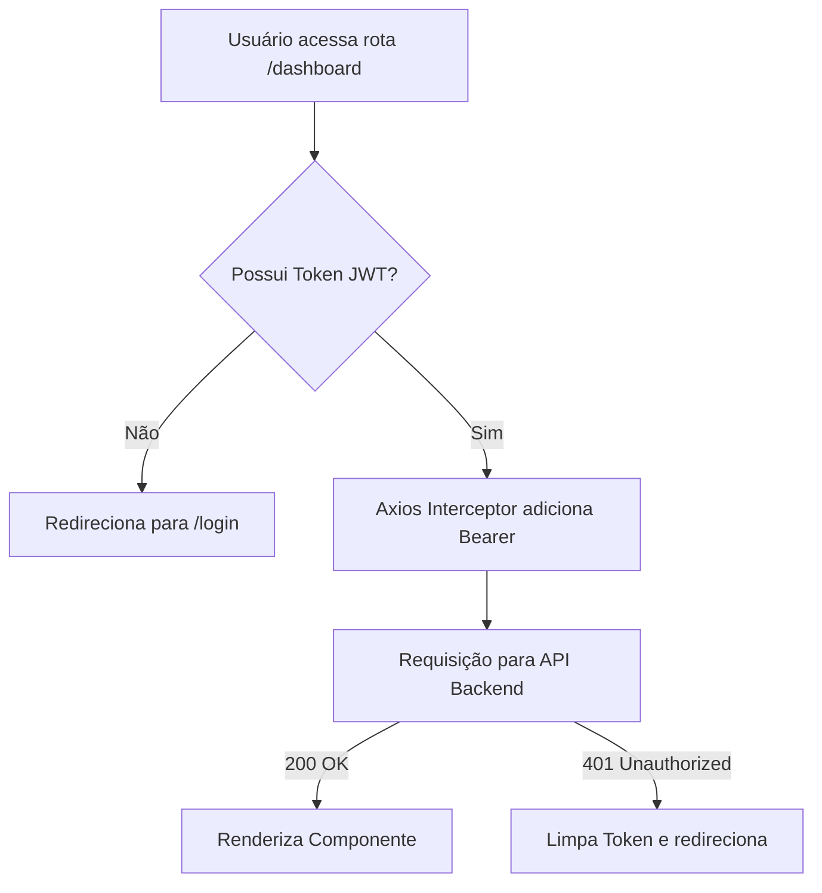

# EmployeeFlow Web

EmployeeFlow Web é o frontend da plataforma EmployeeFlow, desenvolvido em **React + TypeScript** com arquitetura modular baseada em features, integração com API REST e autenticação JWT.

A aplicação simula um sistema corporativo de gestão de funcionários, departamentos, cargos e empresas, consumindo a API backend do ecossistema EmployeeFlow.

## 🔗 Links

- Documentação Scalar: https://employeeflow-api.duckdns.org/scalar/v1
- Frontend: https://employeeflow-web.vercel.app
- Repositório Backend: https://github.com/VStorch/employeeflow-api.git


---

## 🚀 Tecnologias utilizadas

- React 19
- TypeScript
- Vite
- React Router DOM
- Axios
- React Toastify
- CSS
- JWT Authentication
- ESLint

---

## 🧱 Arquitetura

O projeto segue uma organização baseada em **features/domínios**, visando escalabilidade e separação de responsabilidades.

### Estrutura principal

```bash
src/
├── api/
│   └── api.ts
│
├── app/
│   └── routes/
│
├── features/
│   ├── auth/
│   ├── companies/
│   ├── dashboard/
│   ├── departments/
│   ├── employees/
│   └── roles/
│
├── layouts/
├── shared/
└── styles/
```

### Organização por feature

Cada domínio possui:

- **pages** → páginas da feature
- **components** → componentes reutilizáveis
- **services** → comunicação com API
- **types** → contratos TypeScript

Exemplo:

```bash
features/employees/
├── components/
├── pages/
├── services/
└── types/
```



---

## Telas Principais








---

## ⚙️ Destaques técnicos

- Estrutura modular organizada por domínio/features
- Componentização reutilizável com separação clara entre UI, serviços e contratos
- Requisições centralizadas com Axios
- Controle de autenticação via JWT
- Rotas privadas com proteção de acesso
- Organização escalável para crescimento do sistema
- Tipagem forte com TypeScript
- Conventional Commits

---

## 📦 Funcionalidades

### Autenticação

- Login com JWT
- Persistência de token
- Rotas protegidas

### Empresas

- Cadastro de empresas
- Visualização de perfil

### Departamentos

- CRUD completo
- Associação com empresas

### Cargos

- CRUD completo
- Associação com empresas

### Funcionários

- CRUD completo
- Filtros por departamento e cargo

### Dashboard

- Área central da aplicação
- Resumo operacional das entidades cadastradas

---

## 🔐 Autenticação JWT

A aplicação utiliza autenticação baseada em JWT integrada à API backend.

Fluxo:

1. Usuário realiza login
2. Token JWT é armazenado localmente
3. Requisições autenticadas utilizam:

```http
Authorization: Bearer {token}
```

4. Rotas protegidas validam autenticação automaticamente



---

## ▶️ Executando o projeto localmente

1. Clonar o repositório

```bash
git clone https://github.com/VStorch/employeeflow-web.git
```

2. Instalar dependências

```bash
npm install
```

3. Criar arquivo .env

```
VITE_API_URL=UrlDaApi
```

4. Executar a aplicação

```bash
npm run dev
```

---

## 👨‍💻 Autor

Vinícius Storch.

Projeto desenvolvido para fins de estudo e portfólio full stack.
